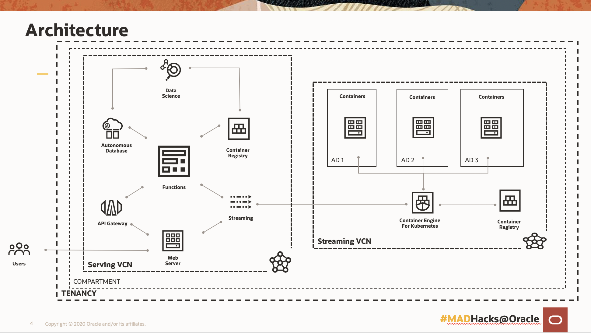

# NAATO --- live package tracking project

**NAVIGATE REPO BRANCHES TO EVALUATE THE DIFFERENT CONPONENTS OF OUR PROJECT**

1. STREAMING BRANCH FOR PRODUCING STREAMING MESSAGES INTO ORACLE STREAMING SERVICE FROM OKE (ORACLE KUBERNETES CLUSTER)
2. FRONT-END BRANCH FOR CONSUMING THE STREAM FROM OCRACLE STEAMING SERVICE AND CREATING A LIVE-PACKAGE TRACKING MAP AND CALLING APIS HOSTED IN ORACLE API GATEWAY FOR PACKAGE ONTIME PREDICTION MODEL
3. CONSUMER BRANCH FOR CONSUMING THE STREAM AND INJECTING IT INTO AN ORACLE AUTONOMOUS DATABASE. 
4. DATA SCIENCE BRANCH FOR DETAILS ON HOW TO TRAIN A ONTIME DELIVERY MODEL

## Architecture Diagram

