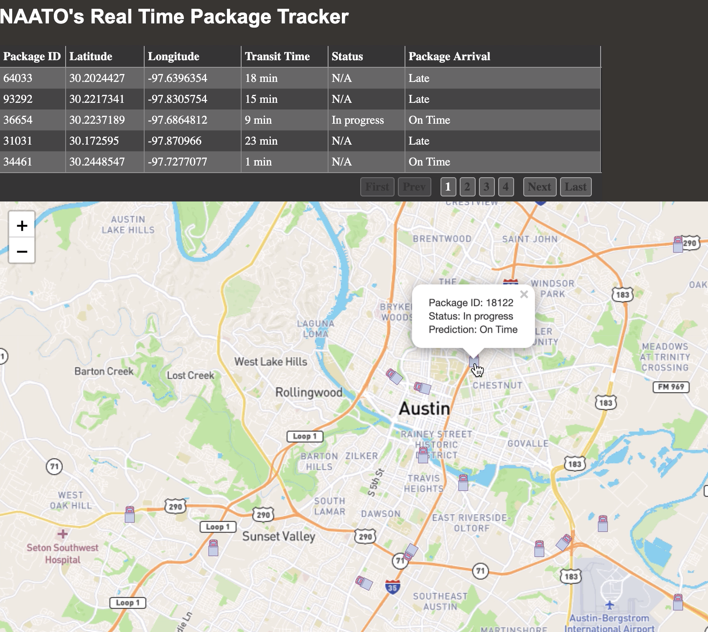

### Front-End Screenshot

## Architecture Diagram

### Table of Contents
0. About
1. Consuming Kafka Stream
2. Library References
3. JS breakdown
4. Run Project

### About

Project front-end responsible to visualize package data points generated from OKE cluster, produced w/ Oracle Kafka Stream and consumed in front-end application. Viewer will distinguish current delivery truck progress as these trucks makes their way to their desitnations. These are the follow metrics that were used on front-end application: PackageID, lat and lon coordinates, Project Status (In progress, late), Predicted (late or on time defined by data science). We will be making use of two open source technologies to realize our front-end: 'Tabulator' (Data Table) and 'Leaflet' (Map).
​
### Consuming Kafka Stream
​
Refer to proejct scripts-"APP.py " and "common_api_streaming_consuming.py" for reference.
- In "APP.py" define stream route destination and consumer application.
- In your python consuming script, configure following connection parameters (Please refer the following: https://docs.cloud.oracle.com/en-us/iaas/Content/Streaming/Tasks/kafkacompatibility_topic-Kafka_Connect.htm#Kafka_Connect)
  - username
  - Generate auth token from user console
  - Region
  - Connection parameters
    1. connection_parameters = {
    "bootstrap_servers":'cell-1.streaming.us-ashburn-1.oci.oraclecloud.com:9092',
    "security_protocol":'SASL_SSL',
    "sasl_mechanism":'PLAIN',
    "sasl_plain_username": username,
    "ssl_check_hostname" : False,
    "sasl_plain_password":'{}'.format(authToken)
    }
Again please refer to scripts for additional configuration requirements.

#### Library References
​
Project Refers to the following open source libraries (References found under "index.html"):
1. Leaflet (https://leafletjs.com/examples/quick-start/)
2. Tabulator (http://tabulator.info/)
​
​
#### JS high-level breakdownb (leaflet.js)
Defining URL to make calls to Data Science for packet delivery status
- Make use of fetch to get a JSON response and integrate prediction to JS map
​Define Map from Leaflet library
Table Defined from Tabulator library
Stream Events process from python consumer stream.
- Data from stream consumed in application for visualization.
Coordinates pushed to Oracle Data Science for package predicted arrival
- Table data overwritten and coordinate markers updated
- Table and marker click events taken into account for front-end responsiveness

#### Run Project
1. Start "common_api_streaming_consuming.py" script for "APP.py" to consume, process and route to index.html. 
2. Run application on host and port defined in "APP.py" (In our case, 'host="0.0.0.0", debug=True, port=5007')

Happy Tracking!